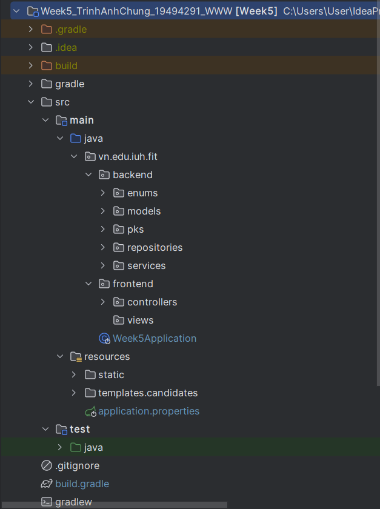
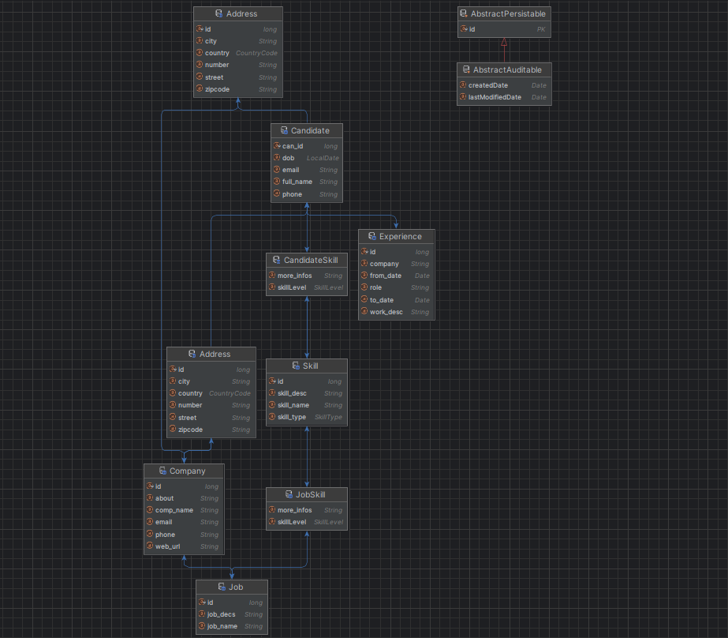
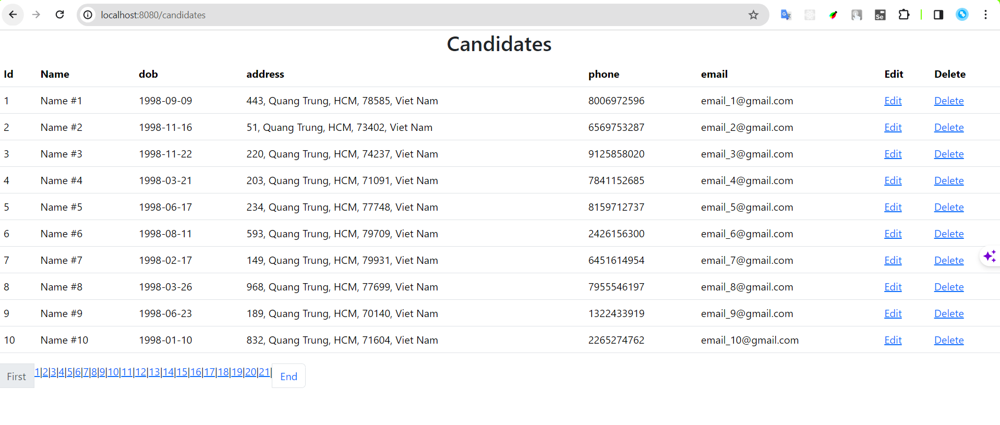
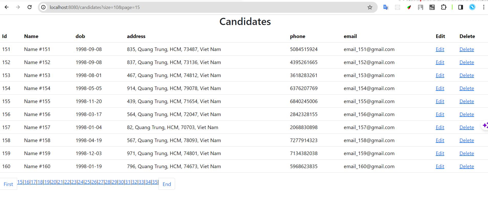
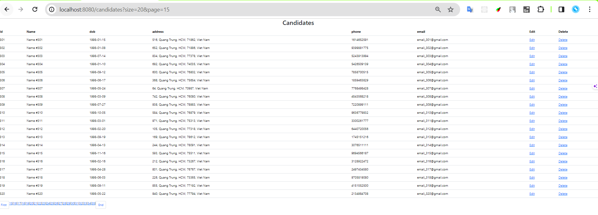
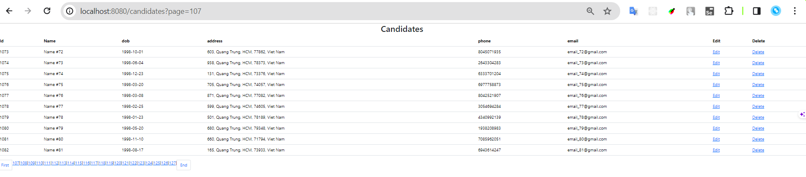

# Week5_TrinhAnhChung_19494291_WWW
### Information:
- Name: Trịnh Anh Chung
- Mssv: 19494291
### Description:
Request: Implement paging function.

## Project architecture
>
## Database
>
## Feature
pagination
## Feature: 
> 

>!

>
>

## The tools that have been used
- IDE: IntelliJ
- Framework: Spring Boot
- Web server: Tomcat
- Database server: MySQL
- Code storage: GitHub
